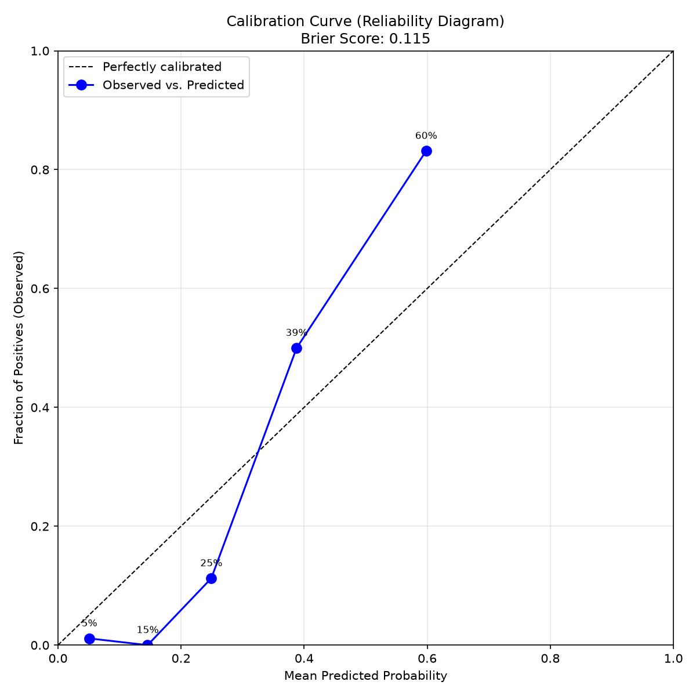

# ⭐ RepoScore: GitHub Repository Quality Predictor

[](https://github.com/mohit4236b-svg/reposcore/actions/workflows/ci.yml)

RepoScore predicts whether a GitHub repository is likely to be a "high-quality" project based on its metadata, README content, and topic tags. Enter any public GitHub repo and get an instant quality prediction, powered by a Random Forest classifier trained on ~2,200 real repositories.

**Live demo:** [reposcoree.streamlit.app](https://reposcoree.streamlit.app/) — paste a repo (e.g. `scikit-learn/scikit-learn`) and get a prediction with confidence score and a feature-level explanation.

---

## Scoring Razorpay's own repos

To demonstrate the model's reasoning, here's how Razorpay's public repositories score:

| repo | quality | confidence | stars | forks |
|------|---------|------------|-------|-------|
| razorpay/razorpay-mcp-server | high | 39% | 229 | 35 |
| razorpay/razorpay-cli | high | 35% | 49 | 6 |
| razorpay/genesis | low | 3% | 1 | 0 |
| razorpay/golib | low | 4% | 0 | 2 |
| razorpay/ai-playbook | low | 29% | 4 | 2 |
| razorpay/n8n-nodes-razorpay | low | 29% | 1 | 1 |
| razorpay/scoop-razorpay-cli | low | 19% | 0 | 0 |
| razorpay/homebrew-razorpay-cli | low | 20% | 0 | 0 |
| razorpay/razorpay-banking-wrapper-sdk | low | 15% | 0 | 0 |
| razorpay/razorpay-turbo-custom | low | 3% | 0 | 0 |
| razorpay/razorpay-turbo-pod | low | 3% | 0 | 0 |
| razorpay/markdown-docs | low | 6% | 0 | 0 |

**What the scores show:** The only two Razorpay repos scoring as "high quality" are the two most mature — `razorpay-cli` (49 stars, 6 forks) and the more recent `razorpay-mcp-server` (229 stars, 35 forks, 42 days of recent activity). Most internal tools and SDKs have few stars, no forks, and little activity, resulting in low confidence predictions. The model's SHAP explanation shows these scores are driven by activity signals (days since last commit, forks) more than README content, reflecting that quality correlates with active maintenance rather than just documentation.

---

## What "quality" means here

There's no built-in "quality" label on GitHub — I had to define one. After testing a stricter version (requiring both CI *and* tests), which produced a heavily imbalanced dataset (~87% negative class), I settled on:

```
quality = 1 if (stars_per_month > median) AND (has_ci OR has_tests)
quality = 0 otherwise
```

A repo counts as "quality" if it's gaining stars faster than the median repo in the dataset **and** has at least one sign of engineering discipline (a CI pipeline or a tests folder). This is a deliberately simple, defensible proxy — not a claim about code quality itself, which isn't something you can fully infer from metadata.

## Dataset

- **2,218 repositories**, collected via the GitHub Search API across five topics: `machine-learning`, `deep-learning`, `nlp`, `computer-vision`, `data-science`
- For each repo: stars, forks, open issues, creation/push dates, README (full text + size), topic tags, and boolean flags for `has_readme`, `has_ci`, `has_tests`
- Class balance: ~71% not-quality / ~29% quality after combining two collection batches (the first single-topic batch had a more severe ~87/13 split)

## Features used

**Structured:** stars, forks, open issues, README size, repo age (days), days since last commit, has_readme

**Text (TF-IDF):**
- README content (500 features)
- Topic tags (100 features)

**Deliberately excluded:** `has_ci`, `has_tests`, and `stars_per_month` are *not* used as model features, since they were used to construct the label itself — including them would be data leakage (the model predicting from its own answer key).

## Results

Earlier versions of this README reported 0.89 accuracy / 0.80 F1 from a single train/test split. That number was optimistic for two compounding reasons, both now fixed:

1. **Badge-markup leakage.** CI-status badges embedded in README text (``) let the model partially recover the `has_ci` signal indirectly, even though `has_ci` itself was correctly excluded as a direct feature.
2. **Single-split variance.** A lucky 80/20 split overstated how well the model generalizes on ~2,200 rows.

The honest numbers, from 5-fold stratified cross-validation on badge-stripped README text:

| Metric | Mean ± std (5-fold CV) |
|---|---|
| F1 (class 1) | 0.610 ± 0.053 |
| Precision (class 1) | 0.904 ± 0.048 |
| Recall (class 1) | 0.463 ± 0.057 |

For comparison, here's the effect of the badge-stripping fix in isolation, both evaluated the same way (5-fold CV):

| Setup | F1 | Precision | Recall |
|---|---|---|---|
| Raw README (badges included) | 0.658 ± 0.043 | 0.898 ± 0.027 | 0.520 ± 0.049 |
| **Badges stripped (current)** | **0.610 ± 0.053** | **0.904 ± 0.048** | **0.463 ± 0.057** |

Stripping badges drops F1 by about 5 points — that gap **is** the leaked signal being removed. Precision barely moves; recall drops, meaning some of what the raw-badge model was "detecting" was really just reading CI badges, not README quality.

A single held-out 80/20 split (used only to produce the confusion matrix and save the deployed model) gives:

| Model | Accuracy | Class 1 Precision | Class 1 Recall | Class 1 F1 | ROC-AUC |
|---|---|---|---|---|---|
| Logistic Regression | 0.71 | 0.50 | 0.65 | 0.56 | — |
| **Random Forest** | **0.83** | **0.88** | **0.50** | **0.63** | **0.94** |

Confusion matrix (Random Forest, held-out set, `[[TN, FP], [FN, TP]]`):
```
[[306   9]
 [ 65  64]]
```
Full metrics are saved to `models/metrics_report.json` on every training run, so results stay auditable instead of hand-copied into this README.

Class imbalance was handled with `class_weight="balanced"` rather than resampling.

### Top predictive features
After removing badge markup, repo activity signals (`stars`, `days_since_last_commit`, `forks`, `open_issues`) still dominate, followed by documentation-related README vocabulary (`docs`, `documentation`, `contributing`, `install`). The badge-related tokens (`workflows`, `shields`, `svg`, `logo`) that used to appear in the top 15 are gone.

## Known limitations

- **Recall at the default threshold (0.46 CV, 0.50 held-out) is genuinely low** — the model misses roughly half of true "quality" repos at the default 0.5 cutoff. This turned out to be a threshold choice, not a fixed ceiling: the default 0.5 isn't F1-optimal. 5-fold CV across thresholds:

  | Threshold | Precision | Recall | F1 |
  |---|---|---|---|
  | 0.3 | 0.665 | 0.893 | **0.762** |
  | 0.4 | 0.789 | 0.722 | 0.754 |
  | 0.5 (default) | 0.894 | 0.474 | 0.619 |
  | 0.6 | 0.983 | 0.267 | 0.420 |
  | 0.7 | 1.000 | 0.121 | 0.216 |

  F1 actually peaks around 0.3, not 0.5. Which threshold is "right" depends on the cost of a false negative vs. a false positive for your use case — there's a slider in the Streamlit app and a `--threshold` flag on the CLI to choose (see below) rather than a single hardcoded cutoff.
- **Topic tags gave only a modest improvement** and didn't produce any single feature in the top 20 — likely because topic information overlaps with vocabulary already present in README text.
- **"Quality" is a proxy, not a ground truth.** Stars-per-month rewards popularity, which correlates with but doesn't equal code quality. A well-written internal tool with few stars would be scored "not quality" here.
- **Badge stripping is regex-based, not exhaustive.** It targets shields.io, badge.fury.io, and similarly-structured badge hosts/markdown patterns; some CI-signal likely still leaks through badge formats the regex doesn't cover.
- **No temporal validation.** The dataset is a single point-in-time snapshot; there's no check for how well the model generalizes to repos created after collection, or to topics outside the five collected here.
- **Confidence score is under-calibrated at the high end.** Brier score is 0.115 (0=perfect, 0.25=random-guessing baseline), so it's meaningfully better than chance overall — but checking predicted-vs-observed in bins shows the model is somewhat *under*-confident on likely-quality repos (when it says ~60% confidence, the true rate in that bin is closer to 83%) and reasonably calibrated in the low range. Read the confidence score as directionally useful, not as a literal probability.

  
  *Reliability diagram: predicted probability bins vs. observed fraction positive. The gap between the diagonal (perfect calibration) and the blue points shows where the model is under- or over-confident.*

## Explainability

The Streamlit app shows a per-prediction SHAP breakdown alongside the score — which specific features (README vocabulary, stars, activity, etc.) pushed this particular repo's prediction toward "high quality" or "low quality." This turns the Random Forest's output from a bare number into something a user can sanity-check against the repo they just looked up.

## Project structure

```
reposcore/
├── app.py                          # Streamlit demo (predicts + explains with SHAP)
├── reposcore_cli.py                # Non-interactive CLI: JSON output, scriptable, CI-usable
├── reposcore_utils.py              # Shared fetch/featurize/predict logic used by BOTH
│                                    #   app.py and reposcore_cli.py, and shared preprocessing
│                                    #   (badge stripping) used by BOTH training and inference,
│                                    #   so none of the three can silently drift apart
├── notebooks/
│   ├── collect_repos.py            # Batch 1: search API collection
│   ├── enrich_repos.py             # Batch 1: README/CI/tests check
│   ├── fetch_readmes.py            # Batch 1: full README text
│   ├── collect_repos_batch2.py     # Batch 2: additional topics
│   ├── enrich_repos_batch2.py      # Batch 2: enrichment
│   ├── fetch_readmes_batch2.py     # Batch 2: README text
│   ├── fetch_topics.py             # Topic tags for full dataset
│   ├── build_dataset_v2.py         # Merge, clean, label
│   └── train_model.py              # Train, CV-evaluate, save model + metrics report
├── tests/
│   └── test_reposcore_utils.py     # Guards the badge-stripping fix + CLI error handling
├── .github/workflows/ci.yml        # Runs tests on every push/PR
├── requirements.txt                # Runtime dependencies
├── requirements-dev.txt            # + pytest, for running the test suite
└── README.md
```

## Running locally

```bash
git clone https://github.com/mohit4236b-svg/reposcore.git
cd reposcore
python -m venv venv
venv\Scripts\activate       # Windows
# source venv/bin/activate  # macOS/Linux
pip install -r requirements.txt
```

Create a `.env` file with your own GitHub personal access token:
 ```
 GITHUB_TOKEN=your_token_here
 ```

 **Important for Streamlit Cloud deployment:** The live demo at [reposcoree.streamlit.app](https://reposcoree.streamlit.app) will exceed the 60 req/hour unauthenticated limit quickly, causing it to fail on many repos. To deploy your own instance or ensure the demo works reliably for local testing, set `GITHUB_TOKEN` in:
 - **Local `.env` file** (shown above), or
 - **Streamlit Cloud secrets**: In your app's settings → Secrets → add `GITHUB_TOKEN=your_token_here`

Run the demo (uses the pre-trained model):
```bash
streamlit run app.py
```

To retrain from scratch, run the scripts in `notebooks/` in order (collection → enrichment → README fetch → topics → dataset build → training).

## CLI usage

The Streamlit app is for interactive one-off lookups. `reposcore_cli.py` does the same scoring non-interactively, for scripting or CI:

```bash
python reposcore_cli.py scikit-learn/scikit-learn pallets/flask
python reposcore_cli.py --file repos.txt --pretty
python reposcore_cli.py owner/repo --format csv > scores.csv
python reposcore_cli.py owner/repo --threshold 0.3   # F1-optimal threshold, see below
```

Outputs JSON (default) or CSV (`--format csv`) with `predicted_quality`, `confidence`, `threshold`, and the underlying signal values per repo, and exits non-zero if any repo failed to score. The classification threshold defaults to 0.5 but is adjustable with `--threshold` — see "Known limitations" below for why 0.5 isn't actually the best choice for every use case. The Streamlit app has the same option as a slider.

Without `GITHUB_TOKEN` set, the GitHub API rate-limits at 60 requests/hour — for scoring more than a handful of repos, set the token in `.env` first (the same requirement [`ossf/criticality_score`](https://github.com/ossf/criticality_score), a similar tool from Google/OpenSSF, has for its own CLI).

## Running tests

```bash
pip install -r requirements-dev.txt
pytest tests/ -v
```

Tests run automatically on every push/PR via GitHub Actions (see `.github/workflows/ci.yml`). They cover the badge-stripping preprocessing step (the fix for the leakage bug described above) and the CLI's error handling, since silent regressions in either would be easy to miss otherwise.

## How this compares to similar tools

Two existing projects are worth comparing against directly:

- **[`ossf/criticality_score`](https://github.com/ossf/criticality_score)** (Google/OpenSSF) scores OSS project *criticality* — a related but different question ("how important/depended-upon is this project" rather than "is this well-built") — using a transparent weighted formula over signals like contributor count, commit frequency, and dependency usage, with per-signal weights and thresholds you can override via a config file. It publishes its scored dataset (CSV + BigQuery) for thousands of repos and ships as a Go CLI. RepoScore's equivalent of that transparency is the SHAP breakdown per prediction — but a formula's weights are inspectable *before* you run it, where SHAP only explains *after* a specific prediction. That's a real trade-off, not just a difference in maturity: the ML approach picks up README-text signal a fixed formula can't, at the cost of a global weighting scheme you can read in one glance.
- **[`clayallsopp/readme-score`](https://github.com/clayallsopp/readme-score)** scores README complexity specifically (not the whole repo) with a small heuristic Ruby gem, packaged with a hosted web checker and an HTTP API, plus an example-scores table in its own README. RepoScore's README-only signal is currently folded into the same model as repo metadata rather than broken out as its own score — a possible future split.

What RepoScore currently has that neither of those does: an ML model (vs. a fixed formula) with a documented, honestly-reported accuracy/recall trade-off and a caught-and-fixed leakage bug. What it's missing relative to both: a published dataset of scored repos, and (unlike `readme-score`) a hosted HTTP API beyond the Streamlit UI — `reposcore_cli.py` above is a step toward the former but not the latter.